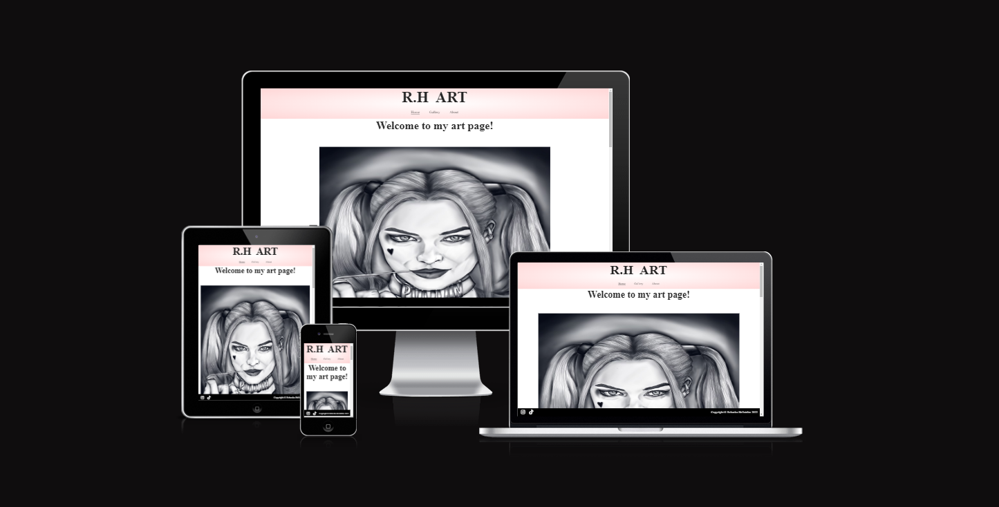
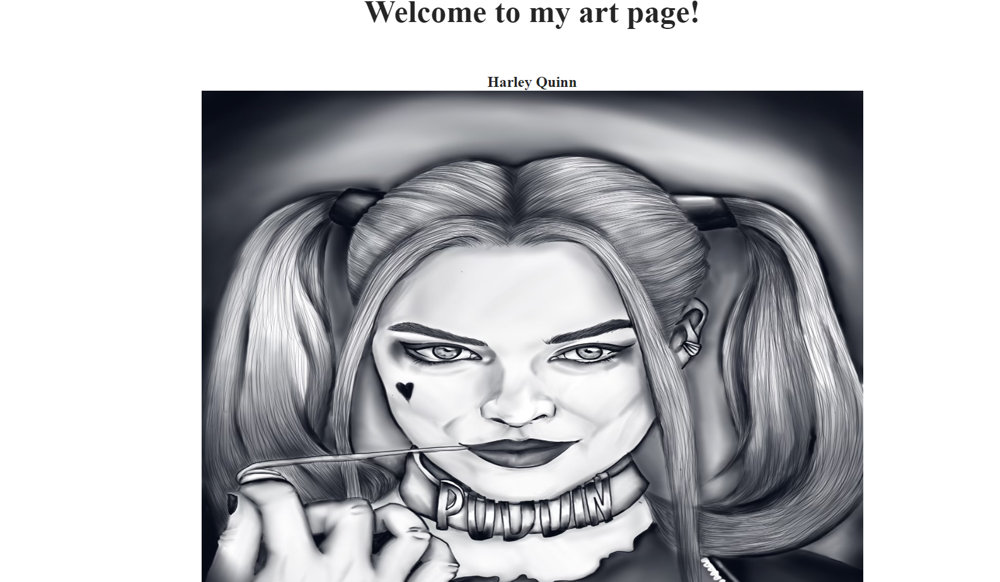
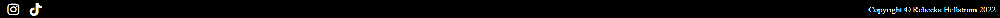
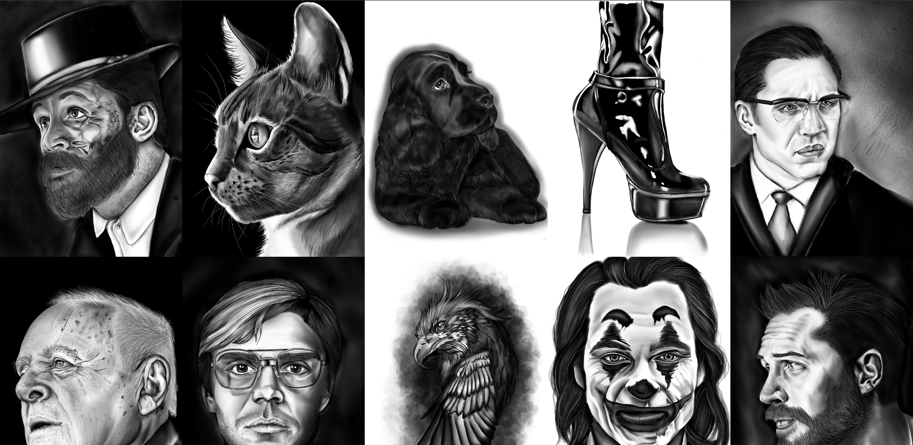
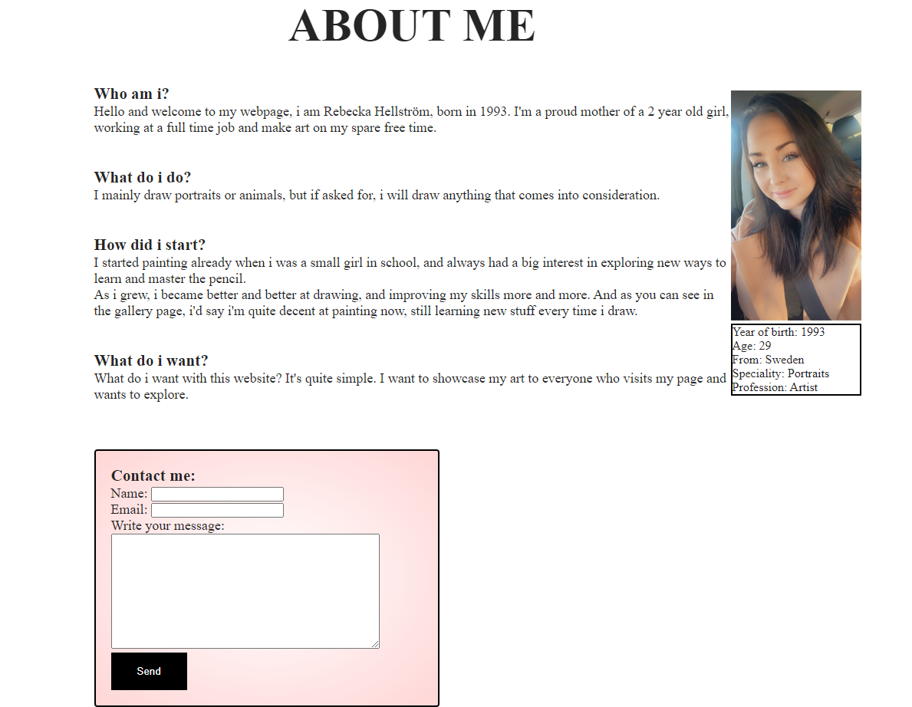
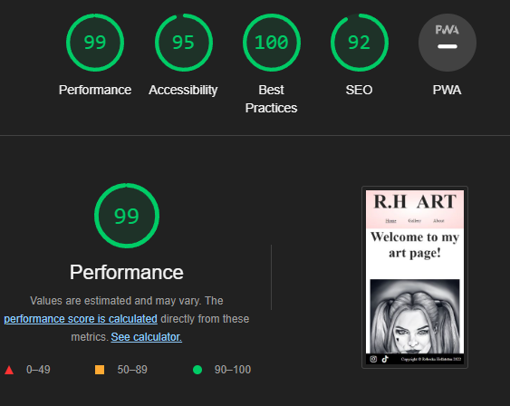
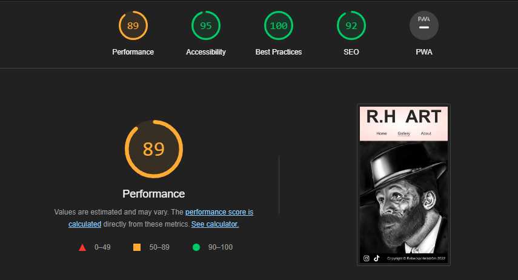
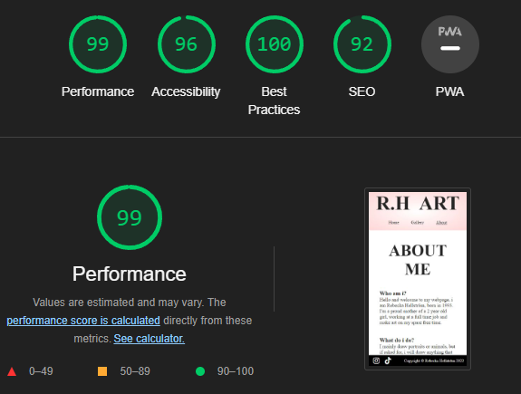

# R.H Art

R.H Art is a landing website for art enjoyers looking for art and drawings.
R.H Art is offering custom made art drawings to anyone who contacts the owner.

Visitors of the website are offered a custom made drawing if they would like to have one, visitors 
can also watch the owners previous work of arts in the form of a gallery.

## Features

* Navigation

  * At the top center of the website is a home link, to always be able to go back to home by pressing R.H Art logo.
  * Below the logo, there is a navigation bar, taking the user to either Home, Gallery or About me page. The navigation links are identical in each page to allow easy navigation.

* The landing page images
  
  * The landing includes some pictures of the owners drawings.
  * The landing includes description about the drawings.
  * The drawings introduces the user very quickly to what kind of website they are visiting.

* Website information section

  * This section contains directions to where you find social medias.
  * This text describes what the owner wants the users to know about the website.

* The Footer

  * The footer section includes links to the owners social medias for easy access.
  * The footer is valuable to the user encourages them to keep track of newly posted drawings and art projects.
  * The footer contains copyright section, as the drawings belong to the owner of the website.

* Gallery
  * The gallery will show what kind of drawings the owner has made.
  * The gallery section is valuable to the user to determine wether they like what they see or not.
  * The gallery will be updated with newly made art projects as they are done.

* About me

  * The about section will give the user info about the website owner.
  * The about section is valuable for the user to quickly get a little knowledge about the owner.
  * The contact form allows the user to contact the owner to send a request or ideas.

# Testing

  * I tested that this page works in different browsers: Chrome, Safari, Firefox

  * I confirmed that this project is responsive, it's looking good on all standard screen sizes using devtools device toolbar.

  * I confirmed that the navigation, header, about me and the gallery, text are all readable and easy to understand.

  * I have confirmed that the form works and gives a response message to the user.

  ## Bugs

  * I have not had any problems with bugs as i have been validating the code all along the project.

  ## Validator Testing

  * HTML
    * No errors were returned when passing through the official W3C validator.
  * CSS
    * No errors were found when passing through the official (Jigsaw) validator.
  * Accessibility
    * I confirmed that the colors and fonts chosen are easy to read and accessible by running it through lighthouse in devtools.

  ## Unfixed bugs
  No unfixed bugs

# Deployment

  * The site was deployed to GitHub pages.

The live link can be found here - [R.H Art](https://undie92.github.io/Portfolio-proj-1/index.html)

# Credits

## Content

 * The code to make the gallery was taken from the CI [Love Running](https://code-institute-org.github.io/love-running-2.0/index.html) Project.